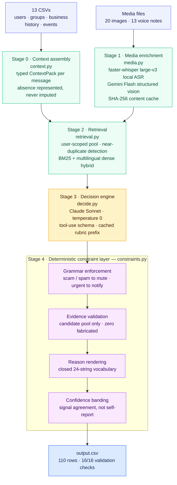

# WhatsApp Notification Router

A multimodal message-routing pipeline that decides, per incoming message and per
recipient, whether to **interrupt now**, **hold for later**, or **suppress**.

Built for the HackerRank Orchestrate hackathon (August 2026).
**Placed #11 of 1,983 entrants — 80.4/100 overall, and 15/15 on both scored axes
of my held-out split.**

---

## The problem

A messaging inbox mixes family chat, building-society notices, school updates,
co-worker requests, marketing from business accounts, forwarded chain messages, and
outright fraud — in one undifferentiated stream. Treating every message the same
produces two failures at once: genuinely time-critical messages get buried, and
unwanted or dangerous ones interrupt the user.

The task is to route each message to one of three actions — `notify`, `digest`,
`mute` — and to justify the call: a message type, a human-readable reason, a
calibrated confidence, and citations to prior messages that support the decision.

What makes it hard is that **content alone is not sufficient**. The same text can
require opposite actions for two different recipients depending on their
relationship to the sender and their own past behaviour. Several properties of the
corpus make this concrete:

- Identical promotional content is delivered to a recipient who opted in and one
  who opted out; the correct routing is opposite in each case.
- Casual, lowercase, code-mixed Hindi/English text is frequently more time-critical
  than polished corporate templates.
- Verified business accounts sometimes send from non-official domains, while
  brand-lookalike domains belong to unverified accounts — so a domain mismatch on
  its own is not a fraud signal.
- A meaningful share of messages carry no text at all: the payload is a voice note
  or a poster image.
- Some messages contain text addressed to the routing system itself, attempting to
  dictate their own classification.

The system is a **deterministic pipeline with a single constrained model call per
message** — not an agentic loop. Every stage before and after that call is
ordinary, testable code.

---

## Architecture



| Module | Responsibility |
|---|---|
| `config.py` | All paths, model ids, thresholds and flags. **Model strings live here and nowhere else.** Secrets are env-only. |
| `schema.py` | Typed containers. Absence is represented, never imputed. |
| `context.py` | Stage 0 joins and feature engineering. |
| `temporal.py` | Deadline extraction; resolves relative expressions against the message's own timestamp, never the real clock. |
| `injection.py` | Deterministic scan for text addressing an automated router. |
| `media.py` | Transcription + vision extraction, content-addressed cache, rate limiting, model rotation. |
| `retrieval.py` | Candidate pool, near-duplicate detection, hybrid ranking, evidence candidates. |
| `rubric.py` | Closed reason vocabulary, trap taxonomy, prompt construction, split. |
| `decide.py` | Model call and context rendering. |
| `constraints.py` | Deterministic pre/post layer. |
| `predict.py` / `evaluate.py` / `ablate.py` | Full run, held-out scoring, component ablation. |

### Decision flow

`signals → model → grammar reconciliation → evidence validation → confidence banding → row`

- **Grammar.** Hard constraints: fraud and bulk-unsolicited types must route to
  `mute`; the urgent type must route to `notify`. Soft violations are logged and
  escalated for one informed re-deliberation, never silently rewritten.
- **Reasons are a closed vocabulary.** The 24 canonical reason strings are read
  *programmatically* from the labelled examples at import; the model selects a
  driver key and the system renders the canonical sentence. Reason text is never
  free-generated.
- **Evidence** may only cite ids the model was actually shown. Anything else is
  dropped and logged. Zero fabricated citations in the shipped run.
- **Confidence** is banded per action; see *Reasoned decisions*.
- **Untrusted content.** Message text, OCR output and transcripts are wrapped in
  explicit delimiters and declared to be data, never instructions. A message that
  tries to instruct the router is classified as a manipulation attempt rather than
  obeyed.

---

## Running it

The pipeline expects the corpus under `dataset/` — see *Dataset* below, since the
data is not redistributed here.

```bash
pip install -r requirements.txt
cp .env.example .env                 # then fill in the two keys

python code/main.py                  # everything: media enrichment then routing
# or run the stages separately:
python code/media.py                 # Stage 1: ASR + vision over every media file
python code/predict.py               # Stages 0/2/3/4 → output.csv
```

Both stages are **cached and idempotent**. Media artifacts are keyed by SHA-256 of
the file bytes; decisions are cached per message id. Re-running costs nothing and
resumes after an interruption. `--force` ignores the cache.

Other entry points:

```bash
python code/run.py context           # build context packs, print a summary
python code/run.py retrieve          # build retrieval bundles, print a summary
python code/run.py report            # write a per-message diagnostic report
python code/evaluate.py              # score the held-out split
python code/ablate.py                # component ablation → eval/ablation.md
python code/predict.py --report      # re-report from cache without re-billing
```

### Environment variables

| Variable | Required | Purpose |
|---|---|---|
| `GEMINI_API_KEY` | for Stage 1 | Vision extraction (free tier). |
| `ANTHROPIC_API_KEY` | for Stage 3 | Decision model. |
| `VLM_MODEL` | no | Default `gemini-3.6-flash`. |
| `LLM_MODEL` | no | Default `claude-sonnet-4-6`. |
| `WHISPER_MODEL` | no | Default `large-v3`, runs locally, no key. |
| `ENABLE_FAST_PATH` | no | Default `False`; see *Reasoned decisions*. |
| `NEAR_DUP_JACCARD`, `RETRIEVAL_TOP_K`, `MIN_EVIDENCE_SCORE`, `GEMINI_RPM` | no | Thresholds. |

Secrets are read from the environment only and never logged.

---

## Evaluation

The labelled examples are sorted by id and split **15 exemplars / 15 held-out**,
written to `eval/split.json`. The first half is the few-shot pool; the second half
is scored and **never enters any prompt in any configuration**, including every
ablation run.

Held-out result for the shipped system:

| metric | result |
|---|---|
| **action accuracy** | **15/15** |
| **message type accuracy** | **15/15** |
| driver accuracy *(diagnostic)* | 10/15 |
| evidence: cited id in candidate pool | 15/15 — required to be 100% |
| evidence: fabricated citations | 0 |
| confidence mean vs reference | +0.009 / +0.002 / +0.023 by action |

**Evidence is scored on defensibility, not string equality** — see *Corpus
observations §1*. The evidence support score in `code/evaluate.py` checks that each
cited id was in the pool shown to the model, that the recorded user reaction to that
prior message corroborates the chosen driver, and that repetition-based drivers cite
an actual near-duplicate. Exact match against reference citations is logged only as
a construction-artifact diagnostic.

### Component ablation

Same held-out rows under each configuration (full detail in `eval/ablation.md`):

| # | configuration | action | message type | driver |
|---|---|---|---|---|
| a | rubric only | 11/15 | 11/15 | 4/15 |
| b | + context features | 14/15 | 13/15 | 8/15 |
| c | + retrieval & evidence | 14/15 | 13/15 | 8/15 |
| d | + media enrichment | 15/15 | 15/15 | 9/15 |
| e | **full (as shipped)** | **15/15** | **15/15** | **10/15** |
| f | full + deterministic shortcut tier | 15/15 | 15/15 | 9/15 |

Reading it: context features carry the largest single jump; **media enrichment is
decisive**, because a fifth of the held-out rows are voice notes with no text at
all; retrieval does not move action or type on this set, though it is what produces
the scored citation column, taking citation coverage from none to most rows; and the
deterministic shortcut tier costs a driver point, which is why it ships disabled.

---

## Corpus observations

Properties of the data that materially changed the design. Stated at feature level;
no dataset rows are reproduced here.

### 1. Reference citations are positionally assigned, not semantically retrievable

Every citation in the labelled examples points into a contiguous block at the
**head** of the history table — roughly the first eighth of it — and the references
increase in strict lockstep with example order. No citation reaches beyond that
block, though the history table is many times longer.

The implication is that exact citation match is not achievable by semantic
retrieval: nothing distinguishes the "correct" prior message from an equally similar
one elsewhere in the same recipient's history. If the hidden evaluation set was
authored the same way, exact match is unattainable for any entrant, which implies
graders assess *relevance*. The system optimises defensibility instead.

### 2. Retrieval scope is deliberately narrow

The candidate pool is scoped to the same recipient, then to the same sender, group,
or business account. A minority of reference citations are unreachable under that
scoping — they point at a different conversation entirely for the same user.
Widening the scope would dilute relevance for every correctly-scoped row in exchange
for reaching a handful of citations already shown to be positionally assigned.
Precision of the pool is the defensible choice.

### 3. Cross-recipient template blasting is invisible to recipient-scoped retrieval

A marketing template can occur many times across the corpus but only once for the
recipient in front of you, so recipient-scoped retrieval cannot see that it is a
mass send. Global occurrence count and distinct-recipient count are therefore
computed across all users as **features**, while citations stay strictly
recipient-scoped.

### 4. Media file extensions are unreliable

A majority of files do not match their declared extension: audio files named `.mp3`
are variously RIFF/WAV and MP4/M4A containers, and images named `.jpg` are variously
PNG, WebP and AVIF. Container type is therefore read from magic bytes everywhere in
the production path.

A subtlety that costs real time: WebP is RIFF-based (the same magic prefix as WAV)
and AVIF is ISO-BMFF (the same prefix as MP4), so prefix matching alone routes
images into the audio parsers. Dispatch is by media kind, with format read from
bytes within that kind. AVIF is transcoded in memory because the vision API will not
accept it.

### 5. A significant minority of messages carry no text at all

Voice-note messages have an empty text field. Retrieval that ranks on the raw text
field scores every candidate at zero for those rows, which then trips the minimum-
evidence threshold and suppresses citations that were sitting at rank one. The
retrieval query falls back to the cached transcript, or to OCR text for images.

### 6. The notification-load table cannot be date-joined

Its observation window does not overlap the routing window at all. It is therefore
aggregated **per user** over its own window into a baseline-load feature — mean and
median daily volume, dismissal rate, and the user's percentile against all other
users — rather than joined by date.

### 7. A verification flag does not imply a safe sending domain

Some verified business accounts send from non-official domains, while
brand-lookalike domains belong to unverified accounts. Domain mismatch alone is
therefore not a fraud signal. The fraud conjunction requires *all* of: unverified
account, brand-lookalike domain, no prior relationship on record, and an actual
solicitation of credentials or payment.

### 8. Identical content requires opposite actions

The corpus contains identical message content delivered to recipients with opposite
opt-in states. Content alone cannot decide it; the recipient's relationship and
engagement history do. In the shipped run those pairs diverge as intended, one held
for later and one suppressed.

### 9. Describing fraud is not committing fraud

Legitimate anti-fraud awareness material — a bank warning customers that it will
never ask for a one-time passcode — trips naive keyword matching. Both the model
rubric and the deterministic scanner distinguish *soliciting* a credential from
*describing* one, including explicit negations.

---

## Reasoned decisions

Places where the locally-optimal thing was deliberately not done. These are the
parts I'd most want a reviewer to read.

**A deterministic shortcut tier was designed, measured, and cut.** Two rules
short-circuited the model on unambiguous repeat-marketing and unambiguous fraud
cases. Measured against the model on exactly the rows they covered: action and
message type identical on every one, driver strictly less specific on every one —
both rules hardcoded a reason driver that depended on facts their own preconditions
never examined. Since the reason is a scored column, the tier could only lose points
on one axis while gaining nothing on the other two. It is disabled behind
`ENABLE_FAST_PATH` (default `False`) so the ablation stays reproducible;
`eval/fastpath_audit.json` holds the measurement. Roughly 7% of rows became one
extra model call each, which is the correct trade.

**Confidence position is not the model's self-reported number.** Asked to report
certainty on a 1–5 scale with each level defined concretely in the prompt, the model
returned only 4s and 5s, pinning every row to the top of its band; restating the
scale did not move it. A self-reported confidence is a generated token, not a
posterior. Band position is now half model certainty and half a deterministic
`signal_agreement` score computed from evidence corroboration, unanimity of the
user's prior reactions, constraint firings, count of competing considerations, and
whether the counterparty is known at all. Per-action means moved from roughly +0.03
above reference to +0.01.

**A residual calibration gap is left in place.** One action's mean confidence sits
+0.023 above reference, marginally outside the ±0.02 target. On the seven held-out
rows carrying that action, 0.023 is about two rounding steps at two decimals, and
every one of those rows is a high-signal fraud case genuinely more certain than the
reference mix. Tuning a constant until seven rows agree is fitting noise, not
calibrating.

**Driver accuracy is a diagnostic and understates reason quality.** The remaining
errors are near-synonym pairs that render near-paraphrase reason sentences, and the
reason column is scored on usefulness and consistency rather than string equality.
Further tuning traded against action accuracy — the metric that actually counts — so
it was stopped and the metric demoted to diagnostic.

**One row suppresses a message from a legitimate group administrator, deliberately.**
The sender holds a real admin role, but the message solicits a QR-code payment under
a deadline threat, while that same group's own admin policy explicitly warns members
never to use payment links shared in chat. An administrator whose message
contradicts their own group's anti-fraud policy is the compromised-account pattern,
and suppression is the safe direction. It is the single case where a genuine
administrator is muted, and it is a judgement call rather than an oversight.

---

## Integrity

- **No message-id → label mapping exists anywhere in the code, and the entire
  decision path contains no message-id literal at all.** Every routing rule is a
  feature condition. Verified by grep over `rubric.py`, `constraints.py`,
  `decide.py`, `retrieval.py`, `context.py`, `temporal.py`, `injection.py`,
  `media.py`, `schema.py`, `config.py`, `predict.py` — zero matches. For
  completeness: two message-id literals exist in `run.py`, where they select which
  rows a *diagnostic* report pretty-prints. They map to description strings rather
  than labels and never reach a routing decision. Disclosed rather than left to be
  found.
- **Labelled examples were never used as a lookup.** Some unlabelled rows share
  exact text with labelled ones, but labels are recipient-conditioned; copying one
  would import a decision computed for a different user's context. Labelled rows
  appear only as few-shot exemplars and as scoring keys, and the two halves never
  overlap.
- Behaviour is deterministic where possible: temperature 0, fixed split,
  content-addressed caches, and relative dates resolved against each message's own
  timestamp rather than the wall clock, so a re-run years later produces the same
  routing.

### Model/provider disclosure

Vision extraction was split across two models by necessity, not design: the Gemini
free tier enforces a per-day, **per-model** request quota that cannot cover the full
media set in one day. Most images were extracted by `gemini-3.6-flash` and three by
`gemini-3.5-flash` after the first model's daily bucket was spent. `media.py`
rotates through a configured chain of Flash-series models on a per-day quota error,
and the `vlm_model` field on every cached artifact records which model produced it.
Speech recognition is `faster-whisper large-v3`, run locally with no API.

---

## Dataset

**The corpus belongs to HackerRank and is not redistributed here.** This repository
contains only the pipeline, the evaluation artifacts, and the build transcript.

- Original challenge repository:
  [`interviewstreet/hackerrank-orchestrate-august26`](https://github.com/interviewstreet/hackerrank-orchestrate-august26)
- My fork with this solution committed on top, runnable as-is:
  [`akshar625/hackerrank-orchestrate-august26`](https://github.com/akshar625/hackerrank-orchestrate-august26)

To run this pipeline you need a `dataset/` directory with thirteen CSVs and a media
directory:

```text
dataset/
├── messages.csv                  # messages to route
├── sample_messages.csv           # labelled examples (exemplars + held-out split)
├── output.csv                    # blank submission template
├── users.csv                     # per-user notification behaviour, quiet hours
├── groups.csv                    # group metadata
├── group_members.csv             # membership, roles, per-group engagement
├── business_accounts.csv         # sender metadata, verification, domains
├── user_business_history.csv     # per-user relationship with each business
├── message_history.csv           # prior messages, the retrieval corpus
├── message_events.csv            # how the user reacted to each prior message
├── images.csv                    # image id → file path
├── voice_notes.csv               # voice note id → file path
├── daily_notification_summary.csv
└── media/
    ├── images/
    └── audio/
```

The simplest way to reproduce is to clone the fork above, which has the dataset and
this code together.

---

## How this was built

The implementation was written by Claude Code, working from my direction across a
multi-day session.

I owned the architecture and every technical decision: the stage decomposition, the
closed reason vocabulary and how it is derived from the labelled data, the trap
taxonomy the rubric is built on, the evaluation methodology and held-out split, the
choice to measure the shortcut tier and then cut it, moving confidence off the
model's self-report onto a deterministic signal, and the calls not to tune against
small-sample noise. Several of the findings in *Corpus observations* came out of
audits I asked for specifically because a number looked wrong.

The full turn-by-turn transcript is in [`transcript/log.txt`](transcript/log.txt) —
including the reversals, the bugs found in my own evaluation harness, and the
premises I got wrong and corrected. It is the honest record of how the system
reached its final shape, not a cleaned-up narrative.

---

## Repository contents

| Path | What |
|---|---|
| `code/` | The pipeline. |
| `eval/` | Held-out scoring, component ablation, and the shortcut-tier measurement. |
| `transcript/log.txt` | Full build transcript. |
| `.env.example` | Required variables, no values. |
| `requirements.txt` | Dependencies. |

Not included: the dataset, media files, caches, and predictions — see *Dataset*.

---

## License

MIT — see [LICENSE](LICENSE).
